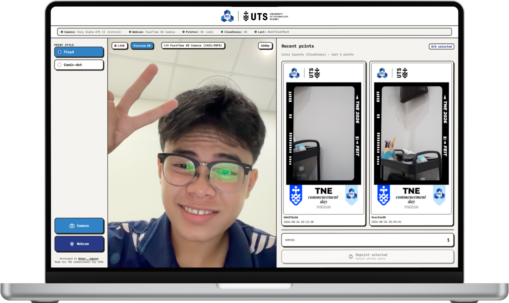
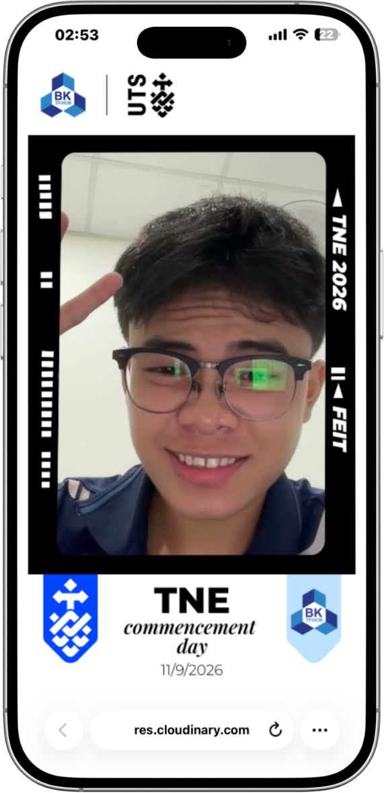
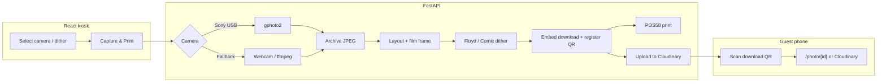

# Thermal Photobooth

macOS photobooth automation for events: **Sony USB tether** (or webcam fallback) → dithered film-strip layout → **POS58 thermal print** + download / register QR.

| Stack | Role |
|-------|------|
| **React + Vite + TypeScript** | Kiosk UI + guest download page |
| **FastAPI (Python)** | Capture, layout, print, Cloudinary upload |
| **gphoto2 / ffmpeg** | Sony tether + webcam |

Each session captures **one portrait (3:4)**, composites it onto a branded template with QR codes, and dithers the strip for 1-bit thermal ink.

---

## Product demo

### TNE Commencement Day 2026

<!-- Drop your event photos here:
  docs/demo/tne-product.jpg   — printed strips / product shot
  docs/demo/tne-guests.jpg    — guests holding freshly printed photostrips
-->

<p align="center">
  <!--  -->
  &nbsp;
  <!--  -->
</p>

<p align="center"><em>Left: product · Right: guests holding freshly printed photostrips — <strong>coming soon</strong></em></p>

### BK Fire · HCMUT Club Day 2026

<p align="center">
  
  &nbsp;
  
</p>

<p align="center"><em>Left: printed strips on the booth table · Right: guests holding freshly printed photostrips</em></p>

---

## Interface

<p align="center">
  
  &nbsp;
  
</p>

<p align="center"><em>Left: kiosk web UI (landscape) · Right: guest page after scanning the download QR (portrait phone)</em></p>

---

## Workflow



**Operator loop**

1. Open the React kiosk at `http://127.0.0.1:8000` (production build) or Vite at `:5173` (dev).
2. Check camera / printer status in the top bar.
3. Pick dither style (`floyd` or `comic`), then **Capture by Camera** or **Capture by Webcam**.
4. Backend shoots one frame → builds the thermal strip → prints → uploads.
5. Guest scans **SCAN TO DOWNLOAD**; optional **SCAN TO REGISTER** uses `REGISTER_QR_URL`.

---

## Requirements

### Hardware

| Device | Notes |
|--------|--------|
| Mac (Intel / Apple Silicon) | macOS 12+ recommended |
| Sony (A7S II or any gphoto2 body) | **Data** USB cable — not charge-only |
| *or* MacBook FaceTime camera | Automatic fallback when Sony is absent |
| Generic POS58 thermal printer | 58mm roll, printable width **384 px @ 203 DPI** |

### Software

| Tool | Version (typical) |
|------|-------------------|
| Homebrew | latest |
| Python | 3.9+ |
| Node.js | 18+ (20/22 LTS fine) |
| npm | 9+ |

### Sony body checklist

1. **USB Connection** = **PC Remote** (or MTP if prompted).
2. **Image Quality** = Fine / Standard (JPEG). Avoid **RAW & JPEG** — the app keeps JPEG only and deletes `.ARW`.
3. Quit Imaging Edge / Photos / Image Capture if they claim the USB device.
4. Plug in the data cable and verify:

```bash
gphoto2 --auto-detect
```

---

## Full setup

### 1. Clone the repo

```bash
git clone https://github.com/shynnguyen1004/ThermalPhotobooth.git
cd ThermalPhotobooth
```

### 2. System packages (Homebrew)

```bash
brew install gphoto2 libgphoto2 libusb ffmpeg
```

macOS often locks the camera via `PTPCamera`. The app kills it before each shot; if USB is still busy:

```bash
killall -9 PTPCamera
# Close Photos / Image Capture / Imaging Edge
gphoto2 --auto-detect
gphoto2 --capture-image-and-download
```

### 3. Python backend

```bash
python3 -m venv .venv
source .venv/bin/activate

pip install --upgrade pip
pip install -r requirements.txt
pip install cloudinary          # required for Cloudinary upload / download QR
```

Optional faster Sony path — Python binding instead of CLI only:

```bash
export LDFLAGS="-L/opt/homebrew/lib"
export CPPFLAGS="-I/opt/homebrew/include"
pip install python-gphoto2
```

Without the binding, the app still works via the `gphoto2` CLI.

### 4. React frontend

```bash
cd frontend
npm install
npm run build          # writes production SPA → frontend/dist
cd ..
```

FastAPI serves `frontend/dist` when `frontend/dist/index.html` exists. Rebuild after UI changes before running `python main.py` alone.

### 5. Environment config

```bash
cp .env.example .env
```

Edit `.env`:

```env
ORG_NAME=University of Technology Sydney

# Cloudinary — color photo + layout strip for guest download
CLOUDINARY_CLOUD_NAME=your_cloud
CLOUDINARY_API_KEY=xxxx
CLOUDINARY_API_SECRET=yyyy
CLOUDINARY_FOLDER=thermal-photobooth

# Optional public guest base (e.g. Render deploy)
PUBLIC_BASE_URL=https://your-app.onrender.com

# Fallback QR when Cloudinary is not configured ({id} = photo id)
QR_BASE_URL=https://your-app.onrender.com/photo/{id}

# Fixed “scan to register” QR
REGISTER_QR_URL=https://forms.gle/your-form

CAMERA_BACKEND=auto          # auto | gphoto | webcam
WEBCAM_DEVICE_INDEX=0

PRINTER_BACKEND=cups         # cups | usb | file
PRINTER_CUPS_NAME=POS58
# PRINTER_VENDOR_ID=0x0416
# PRINTER_PRODUCT_ID=0x5011

REMOVE_BACKGROUND=false      # optional subject cutout before dither

HOST=0.0.0.0
PORT=8000
```

| Variable | Meaning |
|----------|---------|
| `CAMERA_BACKEND` | `auto` (Sony → webcam), `gphoto`, or `webcam` |
| `PRINTER_BACKEND` | `cups` (recommended on macOS), `usb`, or `file` (raster only, no print) |
| `QR_BASE_URL` | Guest page fallback when Cloudinary is off |
| `REGISTER_QR_URL` | Right-side QR on the strip |
| `REMOVE_BACKGROUND` | `true` to cut out subject before dither (needs `rembg`) |
| `ORG_NAME` | Branding label shown in the UI |

### 6. Print assets

Swap templates per event (same sizes). Defaults for the current build:

```
assets/uts_print_layout_template.png    # B&W thermal strip template
assets/uts_upload_layout_template.png   # color layout for Cloudinary / guest download
assets/uts_frame_border.png             # film-strip overlay on the photo box
```

Override via `.env` if needed:

```env
# FRAME_BORDER_PATH=assets/uts_frame_border.png
# PRINT_TEMPLATE_PATH=assets/uts_print_layout_template.png
# PRINT_TEMPLATE_COLORED_PATH=assets/uts_upload_layout_template.png
```

The renderer pastes **one 3:4 photo**, the **download QR**, and the **register QR**. Replace the PNGs (or point env vars at new files) to rebrand for another event.

---

## Run

### Production-style (single process)

Build the SPA, then start FastAPI — it serves the React app from `frontend/dist`:

```bash
cd frontend && npm run build && cd ..
source .venv/bin/activate
python main.py
```

Open **[http://127.0.0.1:8000](http://127.0.0.1:8000)**

### Development (hot reload UI)

Terminal A — API:

```bash
source .venv/bin/activate
python main.py
```

Terminal B — Vite (proxies `/api`, `/photos`, `/prints` to `:8000`):

```bash
cd frontend
npm run dev
```

Open **[http://127.0.0.1:5173](http://127.0.0.1:5173)**

### Dry-run layout (no camera)

```bash
source .venv/bin/activate
python scripts/demo_layout.py path/to/sample.jpg
```

Set `PRINTER_BACKEND=file` to write strips under `data/prints/` without sending jobs to the printer.

---

## Using the kiosk

1. Confirm **Camera** / **Webcam** / **Printer** status indicators.
2. Choose dither: **Floyd** (smooth halftone) or **Comic** (harder contrast).
3. Tap **Capture by Camera** (Sony) or **Capture by Webcam**.
4. Wait for the result drawer — preview strip, reprint with copy count if needed.
5. Guest scans the left QR to download; right QR opens the register link.

| Camera | Result |
|--------|--------|
| Sony USB | 1× portrait 3:4 → film frame → thermal print |
| MacBook webcam | Same layout |

---

## Project layout

```
├── main.py                        # uvicorn entry
├── config/settings.py             # pydantic settings from .env
├── app/
│   ├── application/               # layout, photobooth, bg-remove
│   ├── domain/
│   ├── infrastructure/
│   │   ├── camera/                # gphoto, webcam, auto
│   │   ├── printer/               # POS58 ESC/POS / CUPS
│   │   └── storage/               # local files + Cloudinary
│   └── presentation/
│       └── api.py                 # FastAPI + SPA mount
├── frontend/                      # React + Vite + TypeScript
│   ├── src/
│   │   ├── pages/                 # KioskPage, PhotoPage
│   │   ├── hooks/                 # status, clock, live preview
│   │   └── api/client.ts
│   └── dist/                      # production build (served by FastAPI)
├── assets/                        # print / upload templates + frame overlays
├── docs/demo/                     # README event photos & UI screenshots
├── data/{temp,prints,photos}/
├── scripts/
└── requirements.txt
```

---

## API (backend)

| Method | Path | Description |
|--------|------|-------------|
| `GET` | `/` | React SPA (if built) or legacy Jinja UI |
| `GET` | `/api/config` | Org name, Cloudinary flags |
| `GET` | `/api/status` | Camera(s), printer, Cloudinary, last print |
| `POST` | `/api/capture-print` | Form: `source`, `dither_style`, optional `faculty` |
| `POST` | `/api/reprint-last` | Form: `dither_style`, `copies` |
| `GET` | `/photo/{id}` | Guest download route (SPA) |
| `GET` | `/photos/{id}.jpg` | Archived JPEG |
| `GET` | `/prints/{id}_print.png` | Dithered strip |

`source`: `auto` \| `gphoto` \| `webcam` · `dither_style`: `floyd` \| `comic`

---

## Troubleshooting

**`Could not claim the USB device` / camera busy**  
→ `killall -9 PTPCamera`, close Photos / Image Capture / Imaging Edge.

**Sony missing from `gphoto2 --auto-detect`**  
→ USB Connection = PC Remote, use a data cable, disable Wi‑Fi transfer on the body.

**Kiosk shows blank / old HTML after UI changes**  
→ Rebuild: `cd frontend && npm run build`. FastAPI only serves `frontend/dist`.

**Vite can’t reach the API**  
→ Keep `python main.py` on port 8000; Vite proxies `/api`, `/photos`, `/prints` (see `frontend/vite.config.ts`).

**Printer USB `Access denied`**  
→ `PRINTER_BACKEND=cups`, add POS58 in **System Settings → Printers**, match `PRINTER_CUPS_NAME`.

**Print looks gray / muddy**  
→ Photos are dithered for 1-bit thermal. Raise density; avoid CUPS re-scaling (prefer `usb` when it works).

**Sony also drops `.ARW` files**  
→ Switch Image Quality to Fine/Standard; the app still keeps JPEG only.

**`Chưa cài cloudinary`**  
→ `pip install cloudinary` and fill Cloudinary keys in `.env`.

---

## License

Internal event use.

Made for **TNE Commencement Day 2026** and **BK Fire HCMUT Club Day 2026**.
